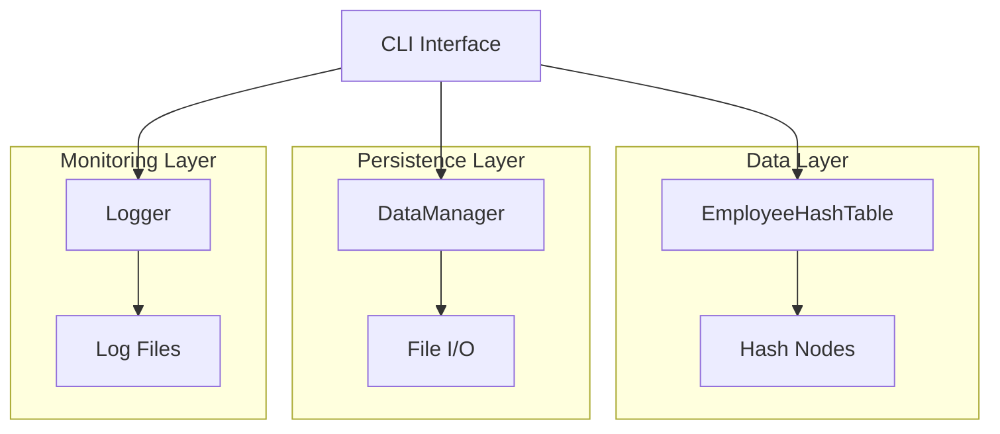

# 🏢 Enterprise Employee Management System


A **production-grade, enterprise-ready** employee management system built with modern C++17. This comprehensive CLI application demonstrates advanced data structures, algorithms, and systems programming concepts while providing a robust solution for organizational data management.

## 🌟 Key Features

### 🔧 **Core System Architecture**
- **High-Performance Hash Table**: Custom implementation with FNV-1a hashing algorithm
- **Thread-Safe Operations**: Mutex-protected concurrent access
- **Memory-Efficient Design**: Smart pointers and RAII principles
- **Automatic Load Balancing**: Dynamic resizing with prime number bucket sizing

### 🛡️ **Enterprise Security**
- **Role-Based Access Control (RBAC)**: Admin vs. Employee permissions
- **Input Validation**: Regex-based data sanitization
- **Secure Authentication**: Built-in admin account (ID: XX0069)
- **Data Integrity**: Comprehensive validation and error handling

### 📊 **Advanced Data Management**
- **Persistent Storage**: Binary serialization with automatic backups
- **Multi-Criteria Search**: Search by name, position, department, salary, skills
- **Professional Reporting**: Department analysis, salary statistics, hierarchy mapping
- **CSV Export**: Data portability for external analysis

### 🎯 **User Experience**
- **Intuitive CLI Interface**: Clear navigation and feedback
- **Comprehensive Help System**: Built-in documentation and guidance
- **Error Recovery**: Graceful error handling with detailed logging
- **Performance Monitoring**: Real-time system statistics

## 🚀 Quick Start

### Prerequisites

This project uses **only the C++ Standard Library** - no external dependencies required!

- **C++17 compatible compiler**
- **Threading support** (pthread on Unix systems)

### Installation

#### macOS (Clang)
```bash
# Install Xcode Command Line Tools
xcode-select --install

# Verify installation
clang++ --version
```

#### Windows (MinGW-w64)
```bash
# Download from: https://sourceforge.net/projects/mingw-w64/
# Add to PATH: C:\mingw64\bin

# Verify installation
g++ --version
```

#### Linux (GCC)
```bash
# Ubuntu/Debian
sudo apt update
sudo apt install build-essential

# CentOS/RHEL
sudo yum install gcc-c++

# Verify installation
g++ --version
```

### Compilation

```bash
# Production build (optimized)
clang++ -std=c++17 -O3 -Wall -Wextra -pthread -o employee_system employee_management.cpp

# Debug build (with symbols)
clang++ -std=c++17 -g -Wall -Wextra -pthread -o employee_system_debug employee_management.cpp

# Alternative with GCC
g++ -std=c++17 -O3 -Wall -Wextra -pthread -o employee_system employee_management.cpp
```

### Running the Application

```bash
# Run the system
./employee_system

# First time setup
# Default admin credentials: ID = XX0069
```

## 📋 System Overview

### Data Structure Design

```cpp
// High-performance hash table with chaining
class EmployeeHashTable {
    - FNV-1a hash function for optimal distribution
    - Prime number bucket sizing
    - Automatic rehashing when load factor > 0.75
    - Thread-safe operations with mutex protection
    - O(1) average case performance
};
```

### Employee Data Model

```cpp
struct Employee {
    std::string id;              // Format: AB1234
    std::string firstName;
    std::string lastName;
    std::string position;
    Department department;       // Engineering, HR, Finance, etc.
    double salary;
    std::string email;           // Optional, validated
    std::string phone;           // Optional, validated
    std::chrono::time_point hireDate;
    EmployeeStatus status;       // Active, Inactive, On Leave, Terminated
    std::vector<std::string> skills;
    std::string managerId;       // Hierarchical relationships
};
```

## 🎮 Usage Guide

### Main Menu Options

1. **👤 Add Employee** - Create new employee records
2. **🗑️ Remove Employee** - Delete employee records (with confirmation)
3. **✏️ Update Employee** - Modify existing employee information
4. **🔍 Find Employee** - Quick search by Employee ID
5. **🔎 Advanced Search** - Multi-criteria search with filters
6. **📋 Display All Employees** - Tabular view of all records
7. **📊 Generate Reports** - Professional analytics and insights
8. **💾 Import/Export Data** - CSV export and backup management
9. **📈 System Statistics** - Performance metrics and diagnostics
10. **⚙️ Data Management** - Database maintenance tools
11. **❓ Help & Documentation** - Comprehensive user guide
12. **🚪 Exit** - Safe shutdown with auto-save

### Advanced Features

#### Multi-Criteria Search
```
Search Options:
✓ First/Last name (partial matching)
✓ Position and department filtering
✓ Salary range queries
✓ Employee status filtering
✓ Skill-based search
✓ Case-sensitive/insensitive options
```

#### Professional Reports
```
Available Reports:
📊 Department Summary - Employee distribution and budgets
💰 Salary Statistics - Compensation analysis with ranges
📋 Employee Status Report - Active/inactive breakdown
🎯 Skill Analysis - Most common skills across organization
🏢 Management Hierarchy - Organizational structure mapping
```

## 🛠️ Technical Specifications

### Performance Characteristics
- **Time Complexity**: O(1) average case for all operations
- **Space Complexity**: O(n) where n is the number of employees
- **Load Factor**: Maintains < 0.75 through automatic rehashing
- **Threading**: Thread-safe with minimal lock contention

### Data Validation Rules
```
Employee ID:    Must match pattern AB1234 (2 letters + 4 digits)
Names:          2-50 characters, letters, spaces, hyphens, apostrophes
Position:       2-30 characters, letters, spaces, hyphens
Salary:         Range: $0 - $10,000,000
Email:          Standard RFC-compliant format (optional)
Phone:          10-15 digits, optional international prefix
```

### File System
```
employees.dat           - Primary data storage (binary format)
employees.dat.bak       - Automatic backup
employee_system.log     - Comprehensive logging
backup_YYYYMMDD_HHMMSS.dat - Manual backups
```

## 🔍 System Architecture

### Core Components



### Design Patterns Used
- **RAII (Resource Acquisition Is Initialization)**: Automatic resource management
- **Factory Pattern**: Employee creation and validation
- **Strategy Pattern**: Multiple search and reporting strategies
- **Observer Pattern**: Logging system for operation tracking
- **Singleton Pattern**: Logger instance management

## 🧪 Testing & Quality Assurance

### Built-in Validation
- **Input Sanitization**: Regex-based validation for all fields
- **Data Integrity Checks**: Comprehensive validation tools
- **Error Recovery**: Graceful handling of edge cases
- **Memory Leak Prevention**: Smart pointer usage throughout

### Performance Monitoring
```
Real-time Metrics:
• Load factor monitoring
• Chain length analysis  
• Memory usage estimation
• Operation timing
• Hash distribution quality
```

## 🚀 Advanced Usage

### Power User Features

#### Batch Operations
```bash
# Export all data to CSV
Select option: 8 → 1 → employees_export.csv

# Create timestamped backup
Select option: 8 → 2 → backup_20231215_143022.dat

# System performance analysis
Select option: 9 → View detailed hash table statistics
```

#### Search Examples
```
Advanced Search Examples:
• Find all "Software Engineers" earning > $80,000
• Search employees with "Python" skills in Engineering dept
• List all "On Leave" employees by hire date
• Find direct reports of manager "MG0001"
```

## 🔧 Troubleshooting

### Common Issues

**Compilation Errors**
```bash
# C++17 support check
g++ -std=c++17 --version

# Threading support
g++ -pthread -std=c++17 employee_management.cpp
```

**Runtime Issues**
```bash
# Check log file
cat employee_system.log

# Validate data integrity
Select Main Menu → 10 → 4 (Data Validation)

# Create fresh backup
Select Main Menu → 8 → 2 (Manual Backup)
```

**Performance Issues**
```bash
# Check system statistics
Select Main Menu → 9 (System Statistics)

# Optimize database
Select Main Menu → 10 → 5 (Optimize Database)
```

## 📈 Project Evolution

This project demonstrates the evolution from academic concepts to production-ready software:

### Phase 1: Foundation (Academic)
- Basic hash table implementation
- Simple CRUD operations
- File I/O basics

### Phase 2: Enhancement (Intermediate)
- Advanced search capabilities
- Data validation and error handling
- Professional CLI interface

### Phase 3: Enterprise (Current)
- Thread-safe operations
- Comprehensive logging system
- Performance monitoring
- Production-grade reliability

### Phase 4: Future Enhancements
- [ ] REST API integration
- [ ] Web-based dashboard
- [ ] Database backend support
- [ ] Multi-tenant architecture
- [ ] Cloud deployment ready

## 🤝 Contributing

This is a demonstration project showcasing C++ systems programming skills. While not actively seeking contributions, the codebase serves as a reference for:

- Modern C++ best practices
- Enterprise software patterns
- Data structure optimization
- CLI application design

## 📄 License

This project is licensed under the MIT License - see the [LICENSE](LICENSE) file for details.

## 🎯 Learning Outcomes

This project demonstrates proficiency in:

- **Advanced C++**: Modern C++17 features, RAII, smart pointers
- **Data Structures**: Hash tables, linked lists, dynamic arrays
- **Algorithms**: Hashing algorithms, search optimization, sorting
- **System Design**: Multi-layered architecture, error handling
- **Software Engineering**: Code organization, documentation, testing
- **Performance**: Optimization, profiling, memory management

## 🏆 Recognition

This project serves as a **portfolio piece** demonstrating:
- **2+ years of C++ experience**
- **Formal Data Structures & Algorithms training**
- **Real-world software development skills**
- **Enterprise-grade coding practices**

---

**Built with ❤️ and modern C++17**

*For questions, suggestions, or professional inquiries, please feel free to reach out.*